# Overengineered TodoList - Domain Model

## UML Class Diagram

```mermaid
classDiagram
    %% ============================================
    %% ENUMS
    %% ============================================
    class TodoStatus {
        <<enumeration>>
        TODO
        IN_PROGRESS
        DONE
        CANCELLED
    }

    class Priority {
        <<enumeration>>
        LOW
        MEDIUM
        HIGH
        URGENT
    }

    %% ============================================
    %% VALUE OBJECTS
    %% ============================================
    class EntityId~T~ {
        <<value object>>
        +UUID value
        +__str__() str
        +__eq__(other) bool
        +__hash__() int
    }

    class UserId
    class TodoListId
    class TodoItemId

    EntityId <|-- UserId
    EntityId <|-- TodoListId
    EntityId <|-- TodoItemId

    class Email {
        <<value object>>
        -str _value
        +Email(value)
        +validate()
        +__str__() str
    }

    class PasswordHash {
        <<value object>>
        -str _value
        +PasswordHash(value)
        +verify(plain) bool
        +__str__() str
    }

    %% ============================================
    %% DOMAIN ENTITIES
    %% ============================================
    class User {
        +UserId id
        +Email email
        +PasswordHash password_hash
        +datetime created_at
        +datetime updated_at
        +register(email, password) User
        +authenticate(password) bool
        +change_password(old, new)
    }

    class TodoList {
        +TodoListId id
        +UserId user_id
        +str name
        +str description
        +datetime created_at
        +datetime updated_at
        +TodoItem[] items
        +rename(new_name)
        +update_description(desc)
        +add_item(title, desc, priority, due_date) TodoItem
        +remove_item(item_id)
        +get_item(item_id) TodoItem
        +get_items_by_status(status) TodoItem[]
    }

    class TodoItem {
        +TodoItemId id
        +TodoListId list_id
        +str title
        +str description
        +TodoStatus status
        +Priority priority
        +datetime due_date
        +datetime created_at
        +datetime completed_at
        +complete()
        +reopen()
        +update_priority(priority)
        +set_due_date(date)
    }

    User "1" --> "0..*" TodoList : owns
    TodoList "1" --> "0..*" TodoItem : contains

    %% ============================================
    %% PORTS (INTERFACES)
    %% ============================================
    class UserRepository {
        <<interface>>
        +save(user)
        +find_by_id(id) User
        +find_by_email(email) User
    }

    class PasswordService {
        <<interface>>
        +hash(password) PasswordHash
        +verify(password, hash) bool
    }

    class TodoListRepository {
        <<interface>>
        +save(todo_list)
        +find_by_id(id) TodoList
        +find_by_user(user_id) TodoList[]
        +delete(id)
    }

    class TodoRepository {
        <<interface>>
        +save(todo_item)
        +find_by_id(id) TodoItem
        +find_by_list(list_id) TodoItem[]
        +delete(id)
    }

    %% ============================================
    %% APPLICATION SERVICES
    %% ============================================
    class AuthService {
        -UserRepository user_repo
        -PasswordService password_svc
        -TokenService token_svc
        +register(email, pwd) User
        +login(email, pwd) Token
        +validate_token(token) User
    }

    class TodoListService {
        -TodoListRepository list_repo
        -TodoRepository todo_repo
        +create_list(user, name, desc) TodoList
        +get_list(user, list_id) TodoList
        +list_user_lists(user) TodoList[]
        +delete_list(user, list_id)
    }

    class TodoService {
        -TodoRepository todo_repo
        -TodoListRepository list_repo
        +create_todo(list_id, title, ...) TodoItem
        +get_todo(todo_id) TodoItem
        +update_todo(todo_id, ...) TodoItem
        +complete_todo(todo_id)
        +delete_todo(todo_id)
        +list_by_status(list, status) TodoItem[]
    }

    %% ============================================
    %% ADAPTERS (INFRASTRUCTURE)
    %% ============================================
    class SQLAlchemyUserRepository {
        -Session session
        +save(user)
        +find_by_id(id) User
        +find_by_email(email) User
    }

    class BcryptPasswordService {
        +hash(password) PasswordHash
        +verify(password, hash) bool
    }

    class SQLAlchemyTodoListRepository {
        -Session session
        +save(todo_list)
        +find_by_id(id) TodoList
        +find_by_user(user_id) TodoList[]
        +delete(id)
    }

    class SQLAlchemyTodoRepository {
        -Session session
        +save(todo_item)
        +find_by_id(id) TodoItem
        +find_by_list(list_id) TodoItem[]
        +delete(id)
    }

    %% Interface implementations
    UserRepository <|.. SQLAlchemyUserRepository
    PasswordService <|.. BcryptPasswordService
    TodoListRepository <|.. SQLAlchemyTodoListRepository
    TodoRepository <|.. SQLAlchemyTodoRepository

    %% Service dependencies
    AuthService ..> UserRepository
    AuthService ..> PasswordService
    TodoListService ..> TodoListRepository
    TodoListService ..> TodoRepository
    TodoService ..> TodoRepository
    TodoService ..> TodoListRepository
```

## Layer Structure

| Layer | Directory | Contents |
|-------|-----------|----------|
| **Domain** | `modules/*/domain/` | Entities, value objects, ports (interfaces), enums |
| **Application** | `modules/*/application/` | Services, use cases, DTOs |
| **Adapters** | `modules/*/adapters/` | SQLAlchemy models, repository implementations, password service, routes |
| **Shared** | `shared/` | Database base, session management, cross-cutting dependencies |
